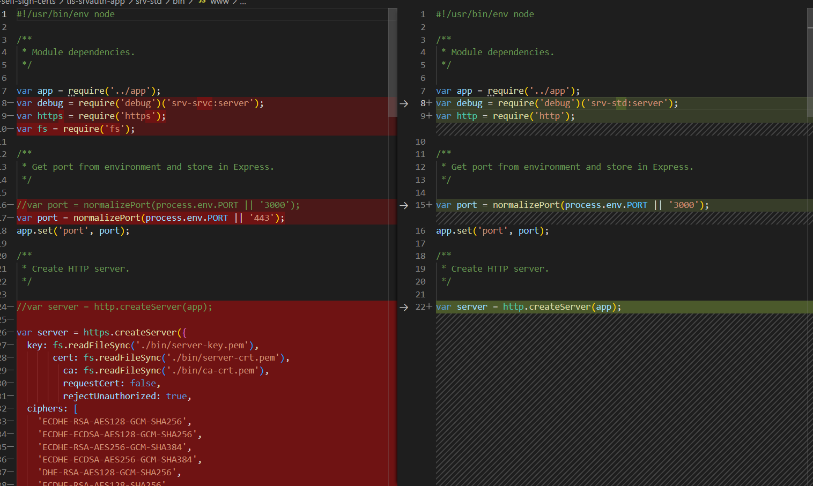
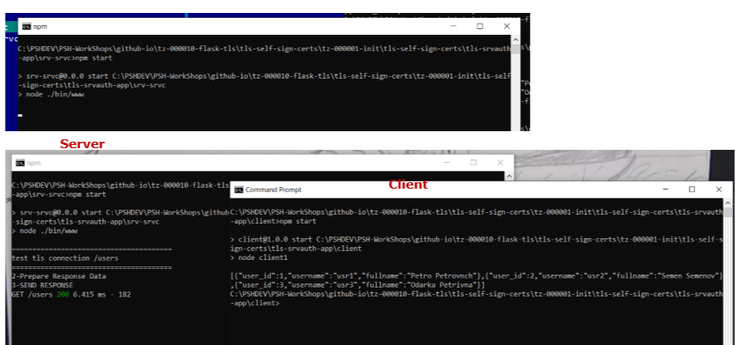
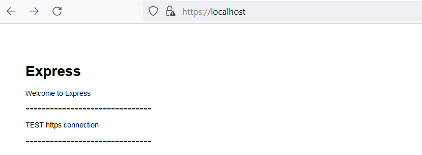
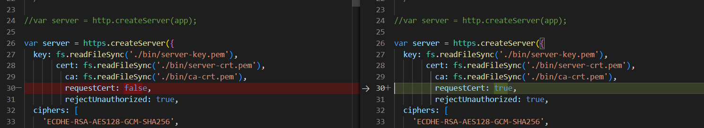
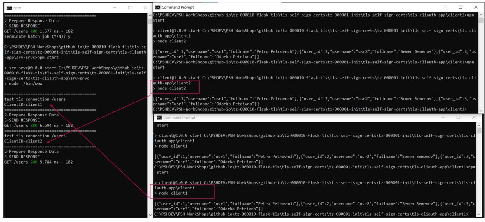
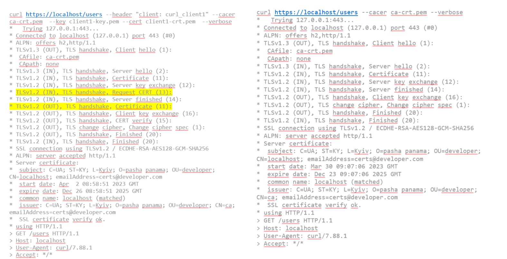

# tls-self-sign-certs Набрі кроків для генерації самопідписних TLS  сертифікатів

# Вступ

Дуже часто  при розроці сервісів потріно вбудовувати шифрування транспортного каналу. Це вимагає доопрацювання програмного забезпечення. Для того, щоб швидко згенерувати TLS сертифікати та перевірити працездатність програмного забезпечення і розроблений цей репозиторій. Ну, і ще, часто приходиться робити моделі зовнішніх сервісів. А зовнішні сервіси працюють по TLS і, щоб відлагодити програмне забезпечення,  роблю моделі, уже з TLS  шифруванням, щоб не переналаштовувати протоколи.

Існує два варіанти TLS  аутентифікації:

- Серверна

Коли клієнт запитує у сервера  кореневий сертифікат ЦСК, яким завірені серверний сертифікат, і звіряє з тим, що є в наявності у клієнта. Це найбільш масовий метод. У всіх клієнтів в наявності тільки один  CA-сертифікат. А на сервері: CA-сертифікат, серврений ключ, серверний сертифікат завірений CA  (Certificate Authorities).

- Клієнтська (або взаємна)

В даном випадку, сервер запитує у клієнта, його клієнтський сертифікат.  При цьому на  сервері: CA-сертифікат, серверний ключ, серверний сертифікат, завірений CA  (Certificate Authorities). На  клієнті CA-сертифікат, клієнтський ключ, клієнтський сертифікат завірений CA. Цей варіант менш розповсюджений. Відверто кажучи, мені тільки раз попадався в практичній роботі.

## Набори команд для генерації сертифікатів

Команди розраховані на використання openssl від git,  що є на windows Laptop. Я розумію, що це не кашерно зараз. Але що маю, те і використовую. Кому потрібно замінять cmd на sh скрипт. 

## STEP-1  Налаштувати конфігураційні фали

Щоб не вводити велику кількість схожих даних, що потім викличе помилки, які важко діагностувати, початкові дані для генерації ключів винесені в конфігураційні файли:

- ca.cnf  конфігураційний файл для генерації кореневого ключа та сертифіката (імітація ЦСК), яким потім будуть завірятися сертифікат сервера.

```text
[ ca ]
default_ca      = CA_default

[ CA_default ]
serial = ca-serial
crl = ca-crl.pem
database = ca-database.txt
name_opt = CA_default
cert_opt = CA_default
default_crl_days = 9999
default_md = md5

[ req ]
default_bits           = 4096
days                   = 9999
distinguished_name     = req_distinguished_name
attributes             = req_attributes
prompt                 = no
output_password        = password

[ req_distinguished_name ]
C                      = UA
ST                     = KY
L                      = Kyiv
O                      = pasha panama
OU                     = developer
CN                     = ca
emailAddress           = certs@developer.com

[ req_attributes ]
challengePassword      = test
```

- server.cnf  конфігураційни файл для генерації сервеного ключа та сертифіката
В даному випадку, сертифікат генерується для localhost **CN = localhost**

```text
[ req ]
default_bits           = 4096
days                   = 9999
distinguished_name     = req_distinguished_name
attributes             = req_attributes
prompt                 = no
x509_extensions        = v3_ca

[ req_distinguished_name ]
C                      = UA
ST                     = KY
L                      = Kyiv
O                      = pasha panama
OU                     = developer
CN                     = localhost
emailAddress           = certs@developer.com

[ req_attributes ]
challengePassword      = password

[ v3_ca ]
authorityInfoAccess = @issuer_info

[ issuer_info ]
OCSP;URI.0 = http://ocsp.developer.com/
caIssuers;URI.0 = http://developer.com/ca.cert
```
Тепер по кроках

### STEP 1 - c1wopssl.bat генерація кореневого сертифіката 
Запукається c1wopssl.bat
виконує команду генерації ключа ca-key.pem та сертифіката ca-crt.pem, використовуючи конфігураційний файл ca.cnf.  По суті емулює ключ Центра Сертифікації  (Certificate Authorities)

```bash
openssl.exe req -new -x509 -days 9999 -config ca.cnf -keyout ca-key.pem -out ca-crt.pem
```

В результаті виконання команди отримаємо 2 файли 
- ca-key.pem приватний ключ
- ca-crt.pem публічний ключ (він же сертифікат)

### STEP-2 - 2wopssl.bat  генерація серверного ключа

Зпускається 2wopssl.bat. В результаті виконання створюється серверний приватний ключ server-key.pem 

```bash
openssl.exe genrsa -out server-key.pem 4096

```

### STEP-3 - 3wopssl.bat  Генерує запит на сертифікат для серверного ключа

Зпускається 3wopssl.bat. В результаті виконання буде створено server-csr.pem. При створенні запиту на сертифікат вкиористовується конфігураційний файл **server.cnf**.

 ```bash
    openssl.exe req -new -config server.cnf -key server-key.pem -out server-csr.pem
 ```

 ### STEP-4 - 4wopssl.bat  Генеруємо підписанй CA ключем  (Certificate Authorities) серверний сертифікат

В результаті викнання команди отримаємо файл server-crt.pem що є публічним сертифікатом серверного ключа

 ```bash
openssl.exe x509 -req -extfile server.cnf -days 999 -passin "pass:password" -in server-csr.pem -CA ca-crt.pem -CAkey ca-key.pem -CAcreateserial -out server-crt.pem

 ```

 ### У підсумку, за 4 кроки створено:
 
 - для клієнтів сервіса створено CA-сертифікат ca-crt.pem
 - для сервера з хостом localhost створено  пара приватного та публічного ключів: server-key.pem,  server-crt.pem та  CA-сертифікат ca-crt.pem.

 На цьому створення необхідних атрибутів для створення TLS  з'єднання с серверною аутентифікацією для host localhost  виконано.

 Для преегляду реквізитів сертифікатів можна викнати view-crt.bat  передавши в якості параметра файл сертифіката

 ```bash
view-crt.bat server-crt.pem 
 ```
 В результаті отрмаємо файл  server-crt.pem.att 

 ```text
Certificate:
    Data:
        Version: 3 (0x2)
        Serial Number:
            09:86:94:df:96:28:99:85:80:80:6d:a3:e3:90:7b:9c:b6:3b:f6:c1
        Signature Algorithm: sha256WithRSAEncryption
        Issuer: C = UA, ST = KY, L = Kyiv, O = pasha panama, OU = developer, CN = ca, emailAddress = certs@developer.com
        Validity
            Not Before: Apr  1 19:57:06 2023 GMT
            Not After : Dec 25 19:57:06 2025 GMT
        Subject: C = UA, ST = KY, L = Kyiv, O = pasha panama, OU = developer, CN = localhost, emailAddress = certs@developer.com
        Subject Public Key Info:
            Public Key Algorithm: rsaEncryption

 ``` 
І тут видно, що  цей сертифікат завірений кореневим сертифікатом (реквізит issuer)

За допомогою  view-key.bat можна переглянути реквізити ключа. Але там корисного тільки алгоритм, як на мене. 

### STEP-5 - Клієнтська аутентифікація: Підготовка конфігураційних файлів клієнта client1.cnf, client2.cnf

Щоб не вводити багато рутинних даних, їх вносимо в конфігураційні файли. В осоновному правилмо реквізити CN  та email
### STEP-6 - Клієнтська аутентифікація: Генеруємо ключ клієнта 1

Запускаємо файл: c1wopssl_сln1.bat. В результаті отримаємо файл приватного ключа: client1-key.pem  

```bash
openssl.exe genrsa -out client1-key.pem 4096

```
### STEP-7 - Клієнтська аутентифікація: Генеруємо запит на створення сертифікату, що ,elt завірений CA

Для wього запускаємо 2wopssl_сln1.bat. В результаті отримаємо файл запиту на публічний сертифікат до CA: **client1-csr.pem**. В цій команді використовується конфігураційний файл клієнта.

```bash
openssl.exe req -new -config client1.cnf -key client1-key.pem -out client1-csr.pem

```
### STEP-8 - Клієнтська аутентифікація:  CA випускає client1 завірений публічний сертифікат

Для wього запускаємо 3wopssl_сln1.bat. В результаті отримаємо файл публічного сертифіката: **client1-crt.pem**. В цій команді використовується конфігураційний файл клієнта.

```bash

openssl.exe x509 -req -extfile client1.cnf -days 999 -passin "pass:password" -in client1-csr.pem -CA ca-crt.pem -CAkey ca-key.pem -CAcreateserial -out client1-crt.pem

```
### STEP-9 - Клієнтська аутентифікація: Перевіряємо сертифікат клієнта та ланцюжок кореневих сертифікатів

Для wього запускаємо 4wopssl_сln1.bat. В результаті отримаємо повідомлення: **client1-crt.pem - OK**. 

```bash

openssl.exe verify -CAfile ca-crt.pem client1-crt.pem

```

### STEP-10 - Клієнтська аутентифікація: Виконуємо пакетно всі кроки для client2

Для цього запускаємо файл  c1-4wopssl_сln2.bat і отримуємо в кінцевому результаті client2-key.pem  та  client2-crt.pem. 


## Тестування сертифікатів для сервреної аутентифікації

Тестування сертифікатів роблю на Node.js. Як на мене, то таке тестування зручніше всього, тому що немає залежностей від trasted store чи чогось подібного. Отже, для тестування створено стандартний node.js express сервер в каталозі **/tls-srvauth-app/srv-srvc**. 

```bash
    express srvpsrvc
```
В файл **/bin/wwww** внесені невеличкі зміни, що дозволяюь серверу запукатися через https. Як видно на [pic-01](#pic-01).

<kbd></kbd>
<p style="text-align: center;"><a name="pic-01">pic-01</a></p>

В каталог **/bin** підкладаємо серврений набір сертифікатів:  server-key.pem,  server-crt.pem та  CA-сертифікат ca-crt.pem, що згенерували. Запускаємо сервер 


```bash
    npm install 
    npm start
```

Сервер доступний по url **https://localhost/**, **https://localhost/users**
Для взаємодії з сервером створено клієнта: **/tls-srvauth-app/client**. Клієнт робить http  запит на стандартний роутер з прикладу node.js express "/users". 

Обидва application запускаються стандартно за допомогою npm start. Роботу можна побачити на екрані на [pic-02](#pic-02).

<kbd></kbd>
<p style="text-align: center;"><a name="pic-02">pic-02</a></p>

Також працює і з браузером  [pic-03](#pic-03).

<kbd></kbd>
<p style="text-align: center;"><a name="pic-03">pic-03</a></p>

Ще, корисно тестувати https сервер за допомогою curl, особливо якщо ввімкнути режиим  verbos:

```bash
curl  https://localhost/users --cacer ca-crt.pem --verbose
```
де:

- cacer файл кореневого сертифікату
- verbose  режим дтального протоклу


```text
curl https://localhost/users --cacer ca-crt.pem --verbose
*   Trying 127.0.0.1:443...
* Connected to localhost (127.0.0.1) port 443 (#0)
* ALPN: offers h2,http/1.1
* TLSv1.3 (OUT), TLS handshake, Client hello (1):
*  CAfile: ca-crt.pem
*  CApath: none
* TLSv1.3 (IN), TLS handshake, Server hello (2):
* TLSv1.2 (IN), TLS handshake, Certificate (11):
* TLSv1.2 (IN), TLS handshake, Server key exchange (12):
* TLSv1.2 (IN), TLS handshake, Server finished (14):
* TLSv1.2 (OUT), TLS handshake, Client key exchange (16):
* TLSv1.2 (OUT), TLS change cipher, Change cipher spec (1):
* TLSv1.2 (OUT), TLS handshake, Finished (20):
* TLSv1.2 (IN), TLS handshake, Finished (20):
* SSL connection using TLSv1.2 / ECDHE-RSA-AES128-GCM-SHA256
* ALPN: server accepted http/1.1
* Server certificate:
*  subject: C=UA; ST=KY; L=Kyiv; O=pasha panama; OU=developer; CN=localhost; emailAddress=certs@developer.com
*  start date: Mar 30 09:07:06 2023 GMT
*  expire date: Dec 23 09:07:06 2025 GMT
*  common name: localhost (matched)
*  issuer: C=UA; ST=KY; L=Kyiv; O=pasha panama; OU=developer; CN=ca; emailAddress=certs@developer.com
*  SSL certificate verify ok.
* using HTTP/1.1
> GET /users HTTP/1.1
> Host: localhost
> User-Agent: curl/7.88.1
> Accept: */*
>
< HTTP/1.1 200 OK
< X-Powered-By: Express
< Content-Type: application/json; charset=utf-8
< Content-Length: 182
< ETag: W/"b6-9+VI/NbG4/IW1rKEaVnNXaQMKMU"
< Date: Sun, 02 Apr 2023 07:37:38 GMT
< Connection: keep-alive
< Keep-Alive: timeout=5
<
[{"user_id":1,"username":"usr1","fullname":"Petro Petrovnch"},{"user_id":2,"username":"usr2","fullname":"Semen Semenov"},{"user_id":3,"username":"usr3","fullname":"Odarka Petrivna"}]* Connection #0 to host localhost left intact

```

Такми чином протестований простий ланцюжок tls  сертифікатів для серверної аутентифікації

## Тестування сертифікатів для клієнтської аутентифікації

тестовий приклад знаходиться в **/tls-cliauth-app**:
- **/srv-srvc** - серер 
- **/client1** - клієнт, що володіє client1.crt
- **/client2**  - клієнт, що володіє client2.crt


Кожне  app запускається шляхом 

```bash
npm install
npm start
``` 

Різниця в сервері між серверною та клієнтською авторизацією показана на [pic-06](#pic-06)
<kbd></kbd>
<p style="text-align: center;"><a name="pic-06">pic-06</a></p>

Більше детальна документація по  https.createServer  за лінком: https://nodejs.org/api/https.html


На [pic-04](#pic-04) показно, як клієнти зробили запити і як на сервері вони успішно обробилися.

<kbd></kbd>
<p style="text-align: center;"><a name="pic-04">pic-04</a></p>


Виклик curl  для цього випадку матиме дещо ширший синтаксис. Потрібно задати всі сертифікати в правильних ключах. Ну, я ще додав заголовок http , щоб розуміти, який клієнт підклчився, а на сервері виводжу його в лог :

```bash

curl https://localhost/users --header "client: curl_client1" --cacer ca-crt.pem  --key client1-key.pem --cert client1-crt.pem  --verbose
```

Тут показаний детальний протокол з'єднання

```text
curl https://localhost/users --header "client: curl_client1" --cacer ca-crt.pem  --key client1-key.pem --cert client1-crt.pem  --verbose
*   Trying 127.0.0.1:443...
* Connected to localhost (127.0.0.1) port 443 (#0)
* ALPN: offers h2,http/1.1
* TLSv1.3 (OUT), TLS handshake, Client hello (1):
*  CAfile: ca-crt.pem
*  CApath: none
* TLSv1.3 (IN), TLS handshake, Server hello (2):
* TLSv1.2 (IN), TLS handshake, Certificate (11):
* TLSv1.2 (IN), TLS handshake, Server key exchange (12):
* TLSv1.2 (IN), TLS handshake, Request CERT (13):
* TLSv1.2 (IN), TLS handshake, Server finished (14):
* TLSv1.2 (OUT), TLS handshake, Certificate (11):
* TLSv1.2 (OUT), TLS handshake, Client key exchange (16):
* TLSv1.2 (OUT), TLS handshake, CERT verify (15):
* TLSv1.2 (OUT), TLS change cipher, Change cipher spec (1):
* TLSv1.2 (OUT), TLS handshake, Finished (20):
* TLSv1.2 (IN), TLS handshake, Finished (20):
* SSL connection using TLSv1.2 / ECDHE-RSA-AES128-GCM-SHA256
* ALPN: server accepted http/1.1
* Server certificate:
*  subject: C=UA; ST=KY; L=Kyiv; O=pasha panama; OU=developer; CN=localhost; emailAddress=certs@developer.com
*  start date: Apr  2 08:58:51 2023 GMT
*  expire date: Dec 26 08:58:51 2025 GMT
*  common name: localhost (matched)
*  issuer: C=UA; ST=KY; L=Kyiv; O=pasha panama; OU=developer; CN=ca; emailAddress=certs@developer.com
*  SSL certificate verify ok.
* using HTTP/1.1
> GET /users HTTP/1.1
> Host: localhost
> User-Agent: curl/7.88.1
> Accept: */*
> client: curl_client1
>
< HTTP/1.1 200 OK
< X-Powered-By: Express
< Content-Type: application/json; charset=utf-8
< Content-Length: 182
< ETag: W/"b6-9+VI/NbG4/IW1rKEaVnNXaQMKMU"
< Date: Sun, 02 Apr 2023 09:53:21 GMT
< Connection: keep-alive
< Keep-Alive: timeout=5
<
[{"user_id":1,"username":"usr1","fullname":"Petro Petrovnch"},{"user_id":2,"username":"usr2","fullname":"Semen Semenov"},{"user_id":3,"username":"usr3","fullname":"Odarka Petrivna"}]* Connection #0 to host localhost left intact
```

На [pic-05](#pic-05) показно, яка різниця виявилася при всановленні з'єднання

<kbd></kbd>
<p style="text-align: center;"><a name="pic-05">pic-05</a></p>